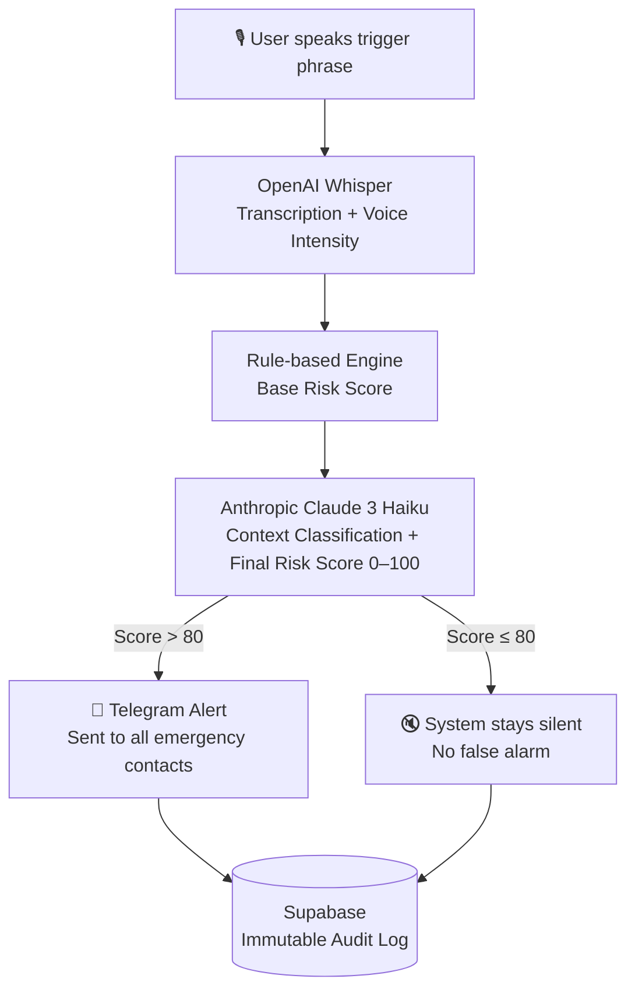

# 🚨 AI-Powered Emergency Voice Intelligence & Risk Alert System

<p align="center">
  
  
  
  
  
  
  
  
  
</p>

<p align="center">
  <b>An AI system that sends emergency alerts from a spoken trigger phrase — no phone unlock, no button press required.</b>
</p>

<p align="center">
  <a href="https://voice-distress-system.onrender.com/api/schema/swagger-ui/">📡 Live API (Swagger UI)</a> ·
  <a href="https://voice-distress-system.onrender.com/api/schema/">OpenAPI Schema</a> ·
  <a href="https://seira-elsa-biju-s-team.docs.buildwithfern.com/voice-distress-system-api/">Fern Docs</a> ·
  <a href="https://voice-distress-system.onrender.com">Live Demo</a>
</p>

---

## 💡 Why I Built This

When I moved to an unfamiliar city alone, I realised something unsettling — there were moments where, if something went wrong, I wouldn't be able to reach my phone and call for help.

We say *"Alexa, turn off the lights"* and it just works. No unlock. No typing. No app.

Why can't we have the same thing for emergencies?

Not a fixed keyword — because those trigger accidentally. Something smarter. Something personal. Something that understands *context* before deciding to fire an alert.

That's what this project is.

---

## 🧠 How It Works



**End-to-end in under 3 seconds.**

---

## ✅ Features

### Emergency Contact Management
- Add, retrieve, update, and delete emergency contacts
- Supports full replace or partial field updates

### Trigger Word Management
- Set any custom trigger phrase — no fixed reserved words
- Update dynamically at any time

### File Management
- Upload audio files and retrieve storage URLs

### Voice Distress Analysis
- Transcription via OpenAI Whisper
- Voice intensity scoring (pitch, speed, tremor)
- AI risk classification via Claude 3 Haiku
- Automated Telegram alert if risk score > 80
- Immutable event log stored in Supabase

### Developer Experience
- Full Swagger UI documentation
- OpenAPI schema
- Published Fern documentation
- 14/14 tests passing (Pytest + Supabase integration + RLS validation)

---

## 🛠️ Tech Stack

| Layer | Technology |
|---|---|
| Backend API | Python 3.12 + Django REST Framework 5 |
| Database | Supabase PostgreSQL |
| Auth & Security | Supabase Auth + Row-Level Security |
| Voice Processing | OpenAI Whisper API |
| AI Engine | Anthropic Claude 3 Haiku (classification + function calling) |
| Alerting | Telegram Bot API |
| API Docs | DRF Spectacular · Swagger UI · Fern |
| Deployment | Render |

---

## 📸 Screenshots

> _Swagger UI_
> https://drive.google.com/file/d/1IJw7JGmsvJKFYnIqlLo-yvCz_FgLbDHw/view?usp=drive_link

> _Telegram alert example_
> https://drive.google.com/file/d/1n08WMhuLHqi-r4bel-s7QRxwFLIkL5FH/view?usp=sharing

---

## ⚙️ Installation & Setup

### 1. Clone the repo

```bash
git clone https://github.com/seira-droid/voice-distress-system
cd voice-distress-system
```

### 2. Create and activate virtual environment

```bash
python -m venv venv

# Windows
venv\Scripts\activate

# Linux / macOS
source venv/bin/activate
```

### 3. Install dependencies

```bash
pip install -r requirements.txt
```

### 4. Set environment variables

Create a `.env` file:

```env
SECRET_KEY=your-secret-key
DEBUG=True
DATABASE_URL=your-supabase-postgres-url
SUPABASE_URL=your-supabase-url
SUPABASE_SERVICE_ROLE_KEY=your-service-role-key
OPENAI_API_KEY=your-openai-key
ANTHROPIC_API_KEY=your-anthropic-key
TELEGRAM_BOT_TOKEN=your-telegram-bot-token
```

### 5. Run migrations and start server

```bash
python manage.py migrate
python manage.py runserver
```

> **Note:** After pulling backend changes, always run `python manage.py migrate` before testing the trigger word endpoint.

---

## 📡 API Endpoints

### Emergency Contacts

| Method | Endpoint |
|---|---|
| GET | `/api/v1/emergency-contacts/` |
| POST | `/api/v1/emergency-contacts/` |
| GET | `/api/v1/emergency-contacts/{id}/` |
| PUT | `/api/v1/emergency-contacts/{id}/` |
| PATCH | `/api/v1/emergency-contacts/{id}/` |
| DELETE | `/api/v1/emergency-contacts/{id}/` |

### Trigger Word

| Method | Endpoint |
|---|---|
| GET | `/api/v1/trigger-word/` |
| PUT | `/api/v1/trigger-word/` |

### File Management

| Method | Endpoint |
|---|---|
| POST | `/api/v1/upload-file/` |
| GET | `/api/v1/file-url/` |

### Voice Analysis

| Method | Endpoint |
|---|---|
| POST | `/api/v1/voice/analyze/` |

### Health Check

| Method | Endpoint |
|---|---|
| GET | `/api/v1/diagnose/` |

Full interactive docs: [Swagger UI →](https://voice-distress-system.onrender.com/api/schema/swagger-ui/)

---

## 🗂️ Project Structure

```
voice-distress-system/
│
├── backend/
│   ├── distress_app/
│   ├── config/
│   ├── utils/
│   ├── manage.py
│   └── requirements.txt
│
├── frontend/          # Lightweight API console (in progress)
│   └── index.html
│
├── docs/
├── CONTRIBUTING.md
└── README.md
```

---

## 🧪 Testing

- **14/14 tests passing**
- Pytest configured
- Supabase integration tests included
- RLS (Row-Level Security) validation tests included
- All endpoints verified on live Render deployment via Postman + Swagger

---

## 🚧 Roadmap

- [x] Emergency contact management (CRUD)
- [x] Custom trigger word per user
- [x] Audio file upload + URL retrieval
- [x] Voice transcription + intensity analysis
- [x] Claude AI risk scoring + classification
- [x] Telegram alert system
- [x] Immutable audit log
- [x] Full Swagger + Fern documentation
- [ ] Frontend UI (voice recording button — in progress)
- [ ] Real-time voice processing
- [ ] Acoustic emotion detection (tone, pitch, stress)
- [ ] SMS alert support
- [ ] Location tracking integration
- [ ] Mobile app

---

## 👩‍💻 Author

**Seira Elsa Biju**
AI & Python Developer Intern · Aspiring ML/AI Engineer

[](https://github.com/seira-droid)
[![LinkedIn]https://www.linkedin.com/in/seira-elsa-biju-215782292/

---

## 📄 License

Educational / internship project. All rights reserved.
