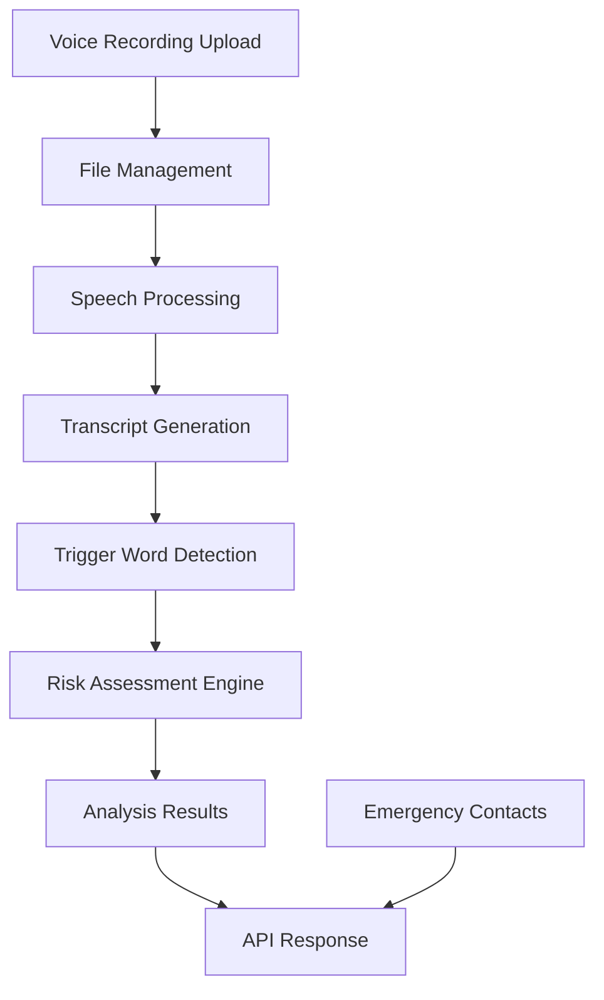

# Voice Distress System

## Overview

Voice Distress System is a safety-focused backend application built using Django and Django REST Framework. The system analyzes voice recordings to identify potential distress situations and generate risk assessments. It currently evaluates speech content by detecting distress-related phrases, trigger words, and contextual indicators from voice-derived transcripts. The platform also provides emergency contact management, file handling, and API-based access to distress analysis results.

The project is designed to evolve beyond transcript analysis by incorporating advanced acoustic voice analysis techniques such as pitch, tone, speech rate, stress patterns, and emotional indicators, enabling more accurate detection of distress even when explicit emergency keywords are not spoken.

---

## Problem Statement

In emergency situations, individuals may not always be able to manually contact emergency services or explain their condition. Traditional safety systems often depend on direct user interaction, which may not be possible during distress. The Voice Distress System aims to support emergency response workflows by analyzing voice recordings, detecting distress indicators, assessing risk levels, and providing structured information that can be used for timely intervention.

---

## Features

### Emergency Contact Management

* Create emergency contacts
* Retrieve all emergency contacts
* Retrieve contact details by ID
* Update contact information
* Delete emergency contacts

### Trigger Word Management

* Retrieve the current trigger word
* Update trigger words dynamically through API

### File Management

* Upload audio files
* Retrieve uploaded file URLs
* Store audio resources for analysis

### Voice Distress Analysis

* Process uploaded voice recordings
* Analyze speech-derived transcripts
* Detect distress-related phrases and keywords
* Detect trigger words
* Calculate intensity scores
* Generate risk assessment scores
* Return structured analysis results

### API Documentation

* Interactive Swagger UI documentation
* OpenAPI schema generation using DRF Spectacular
* API testing support through Swagger

---

## Technology Stack

### Backend

* Python
* Django
* Django REST Framework (DRF)

### API Documentation

* DRF Spectacular
* Swagger UI
* OpenAPI Specification

### Database

* SQLite

### Development & Testing Tools

* Git
* GitHub
* Postman

---

## Project Structure

```text
voice-distress-system/
│
├── emergency_contacts/
├── trigger_words/
├── voice_analysis/
├── file_management/
├── utils/
├── docs/
├── media/
├── manage.py
├── requirements.txt
└── README.md
```

> Update the folder structure if your actual project folders differ.

---

## Installation & Setup

### Clone Repository

```bash
git clone <repository-url>
cd voice-distress-system
```

### Create Virtual Environment

```bash
python -m venv venv
```

### Activate Virtual Environment

#### Windows

```bash
venv\Scripts\activate
```

#### Linux / macOS

```bash
source venv/bin/activate
```

### Install Dependencies

```bash
pip install -r requirements.txt
```

### Apply Database Migrations

```bash
python manage.py migrate
```

### Run Development Server

```bash
python manage.py runserver
```

The application will be available at:

```text
http://127.0.0.1:8000/
```

---

## API Documentation

### Swagger UI

```text
http://127.0.0.1:8000/api/schema/swagger-ui/
```

### OpenAPI Schema

```text
http://127.0.0.1:8000/api/schema/
```

---

## API Endpoints

### Emergency Contacts

| Method | Endpoint                        |
| ------ | ------------------------------- |
| GET    | `/api/emergency-contacts/`      |
| POST   | `/api/emergency-contacts/`      |
| GET    | `/api/emergency-contacts/{id}/` |
| PUT    | `/api/emergency-contacts/{id}/` |
| DELETE | `/api/emergency-contacts/{id}/` |

### Trigger Word Management

| Method | Endpoint                |
| ------ | ----------------------- |
| GET    | `/api/v1/trigger-word/` |
| PUT    | `/api/v1/trigger-word/` |

### File Management

| Method | Endpoint               |
| ------ | ---------------------- |
| POST   | `/api/v1/upload-file/` |
| GET    | `/api/v1/file-url/`    |

### Voice Analysis

| Method | Endpoint                 |
| ------ | ------------------------ |
| POST   | `/api/v1/voice/analyze/` |

---

## Testing

### Postman

API endpoints have been tested using Postman collections and request examples.

### Swagger UI

Interactive API testing and documentation are available through Swagger UI.

---

## Screenshots

### Swagger UI

*Add screenshot here*

```text
docs/images/swagger-ui.png
```

### Postman API Testing

*Add screenshot here*

```text
docs/images/postman.png
```

### Django Admin Dashboard

*Add screenshot here*

```text
docs/images/admin-dashboard.png
```

---

## Architecture Overview



---

## Future Improvements

* Real-time audio processing
* Acoustic voice analysis using pitch and tone features
* Emotion and stress detection from voice signals
* Panic detection without relying solely on trigger words
* Advanced AI-based distress detection
* SMS alert integration
* Live emergency notifications
* Location sharing and tracking
* Mobile application integration
* Multi-language distress analysis
* Emergency response automation

---

## Live Demo

### Deployment URL

```text
Coming Soon
```

---

## Contributors

* Seira Elsa Biju

---

## License

This project is developed for educational, research, and internship purposes.
